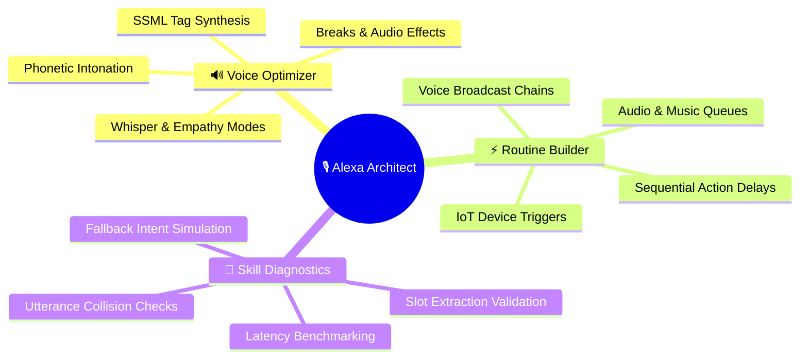
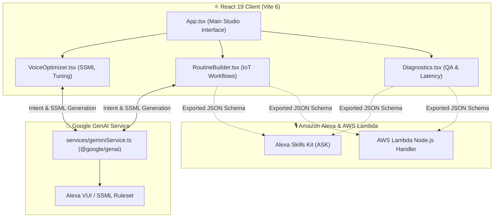

<!-- 🎙️ ALEXA AUTOMATION ARCHITECT — REPOSITORY PRESENTATION (L3 SHOWCASE) -->

<div align="center">


# **🎙️ Alexa Automation Architect**

**A professional voice interface engineering studio, smart home routine designer, and SSML voice optimizer powered by React 19, TypeScript, Vite, and Google Gemini 2.0.**

[](#-core-workspaces)
[](package.json)
[](tsconfig.json)
[](vite.config.ts)
[](package.json)
[](package.json)
[](LICENSE)
[](https://github.com/traikdude/Alexa-Automation-Architect)

<p align="center">
  <a href="#-overview"><b>Overview</b></a> •
  <a href="#-core-workspaces"><b>Workspaces</b></a> •
  <a href="#-routine-flow--voice-engine"><b>Routine Engine</b></a> •
  <a href="#-diagnostics--qa"><b>Diagnostics</b></a> •
  <a href="#-architecture"><b>Architecture</b></a> •
  <a href="#-quick-start--local-development"><b>Quick Start</b></a> •
  <a href="#-contributing"><b>Contributing</b></a> •
  <a href="#-license"><b>License</b></a>
</p>

</div>

---

## 📑 Table of Contents

- [✨ Overview](#-overview)
- [🎙️ Core Workspaces](#-core-workspaces)
  - [1. SSML Voice Optimizer & Acoustic Tuner](#1-ssml-voice-optimizer--acoustic-tuner)
  - [2. Visual Smart Home Routine Builder](#2-visual-smart-home-routine-builder)
  - [3. Voice Skill Diagnostics & Latency QA](#3-voice-skill-diagnostics--latency-qa)
- [🔊 Routine Engine & SSML Flow](#-routine-engine--ssml-flow)
- [🔬 Diagnostics & Quality Assurance](#-diagnostics--quality-assurance)
- [🏗️ Architecture & Data Flow](#-architecture--data-flow)
- [🛠️ Tech Stack](#-tech-stack)
- [⚡ Quick Start & Local Development](#-quick-start--local-development)
- [🗂️ Repository Structure](#-repository-structure)
- [🤝 Contributing](#-contributing)
- [📄 License](#-license)

---

## ✨ Overview

**Alexa Automation Architect** is an advanced voice user interface (VUI) design studio and smart home automation orchestrator.

Engineered with **React 19**, **Tailwind CSS v4**, **Motion**, and **Google Gemini 2.0**, the platform enables voice engineers and IoT architects to compose natural Speech Synthesis Markup Language (SSML), sequence multi-device smart home routines, and benchmark utterance response latencies before deployment to Alexa Skills Kit (ASK) or AWS Lambda.

---

## 🎙️ Core Workspaces



### 1. SSML Voice Optimizer & Acoustic Tuner
Fine-tune speech synthesis with expressive SSML tags (`<emphasis>`, `<prosody>`, `<amazon:emotion>`, `<break>`), phonetic pronunciation respellings, and natural pauses.

### 2. Visual Smart Home Routine Builder
Compose automated smart home routines linking Alexa wake phrases to lighting scenes, thermostat settings, smart locks, audio announcements, and scheduled timers.

### 3. Voice Skill Diagnostics & Latency QA
Simulate voice intent classification, test edge-case slot values, identify phonetically ambiguous utterances, and review end-to-end response times.

---

## 🔊 Routine Engine & SSML Flow

```text
┌────────────────────────────────────────────────────────────────────────┐
│                     ALEXA ROUTINE & SSML PIPELINE                      │
├───────────────────────┬────────────────────────┬───────────────────────┤
│ 🎙️ Voice Trigger      │ ⚡ Automated Sequence   │ 🏡 IoT Output         │
│ • "Alexa, Movie Time" │ • Dim Lights to 10%    │ • Living Room Lights  │
│ • "Alexa, Bedtime"    │ • Lock Front Door      │ • Smart Locks         │
│ • "Alexa, Focus Work" │ • Play Lo-Fi Ambient   │ • Multi-Room Audio    │
└───────────────────────┴────────────────────────┴───────────────────────┘
```

---

## 🔬 Diagnostics & Quality Assurance

| Diagnostic Check | Validation Purpose | Metric / Threshold |
|---|---|---|
| 🎯 **Intent Match Rate** | Verifies utterance mapping to primary intent | ≥ 98% accuracy |
| ⚡ **VUI Response Latency** | Measures time-to-first-speech token | < 600ms target |
| 🛡️ **Fallback Coverage** | Ensures graceful fallback when intent is unclear | 100% test coverage |
| 🔊 **SSML Audio Conformance**| Validates XML syntax and supported audio bitrates | 48kHz, 48kbps MP3 |

---

## 🏗️ Architecture & Data Flow



---

## 🛠️ Tech Stack

* **Frontend Framework**: React 19 (`react` 19.0.0, `react-dom` 19.0.0)
* **Language & Typing**: TypeScript 5.8.2 (`tsconfig.json`)
* **Build System**: Vite 6.2.0 (`vite.config.ts`)
* **Styling**: Tailwind CSS v4 (`@tailwindcss/vite` 4.1.14)
* **Animations**: Motion (`motion` 12.23.24)
* **AI Orchestration SDK**: Google GenAI SDK (`@google/genai` 1.29.0)
* **Iconography**: Lucide React (`lucide-react` 0.546.0)

---

## ⚡ Quick Start & Local Development

### Prerequisites
* [Node.js](https://nodejs.org/) (v18+ or v20+)
* [Google Gemini API Key](https://aistudio.google.com/)

### Setup Instructions
1. Clone the repository:
   ```bash
   git clone https://github.com/traikdude/Alexa-Automation-Architect.git
   cd Alexa-Automation-Architect
   ```
2. Install dependencies:
   ```bash
   npm install
   ```
3. Set your Gemini API key in `.env`:
   ```bash
   GEMINI_API_KEY="your-gemini-api-key-here"
   ```
4. Start development server:
   ```bash
   npm run dev
   ```
5. Open `http://localhost:3000` in your browser.

---

## 🗂️ Repository Structure

```text
Alexa-Automation-Architect/
├── docs/                        # Presentation & visual assets
│   └── assets/
│       └── banner.png           # L3 Showcase high-resolution hero banner
├── src/
│   ├── components/
│   │   ├── Diagnostics.tsx      # Voice skill QA & latency tests
│   │   ├── RoutineBuilder.tsx   # Smart home routine flow constructor
│   │   └── VoiceOptimizer.tsx   # SSML tag optimizer & acoustic editor
│   ├── services/
│   │   └── geminiService.ts     # Google GenAI VUI prompt synthesis
│   ├── App.tsx                  # Studio navigation & mode coordinator
│   ├── index.css                # Tailwind CSS styling entry
│   └── main.tsx                 # React 19 DOM entrypoint
├── package.json                 # Project dependencies & scripts
├── tsconfig.json                # TypeScript compiler configuration
├── vite.config.ts               # Vite bundler configuration
├── README.md                    # L3 Showcase presentation documentation
└── LICENSE                      # MIT Open Source License
```

---

## 🤝 Contributing

1. Fork the repository and create your branch (`git checkout -b feature/new-ssml-preset`).
2. Add new SSML templates in `VoiceOptimizer.tsx` or IoT triggers in `RoutineBuilder.tsx`.
3. Verify that the build passes type checks: `npm run lint && npm run build`.
4. Submit a Pull Request.

---

## 📄 License

Distributed under the **MIT License**. See [LICENSE](LICENSE) for details.

---

<div align="center">

*Engineered for Voice UI Architects, IoT Automators & Ambient AI Agents.*  
**Alexa Automation Architect · React 19 · TypeScript · Tailwind v4 · Google GenAI**

</div>
